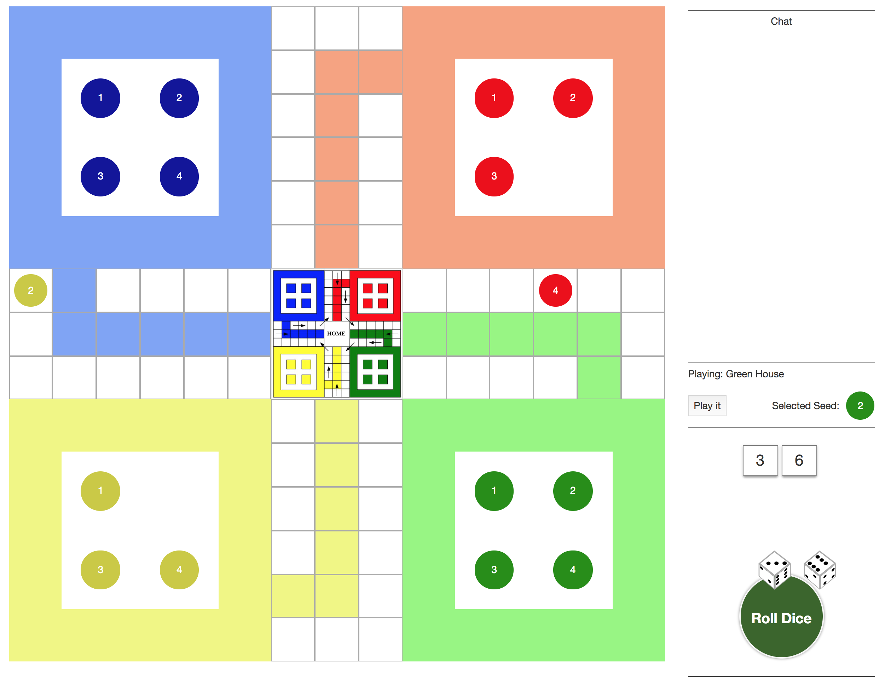

## Ludo Game

### What is this repository for?
Online Ludo game built with React.

##### Prerequisite
- Install nvm, node, npm, and yarn.

### How do I get set up for development?
- Run *_nvm use_* to set node version to 8.9.4
- Run *_yarn install_* in the application root to install dependencies
- Use *_npm run dev_* to start developing

### How do I build the app? (Not setup yet!)
- Run *_nvm use_* to set node version to 8.9.4
- Run *_yarn install_* in the application root to install dependencies.
- Run *_npm run build_* to build the app.

### Screenshot
Game Screen

