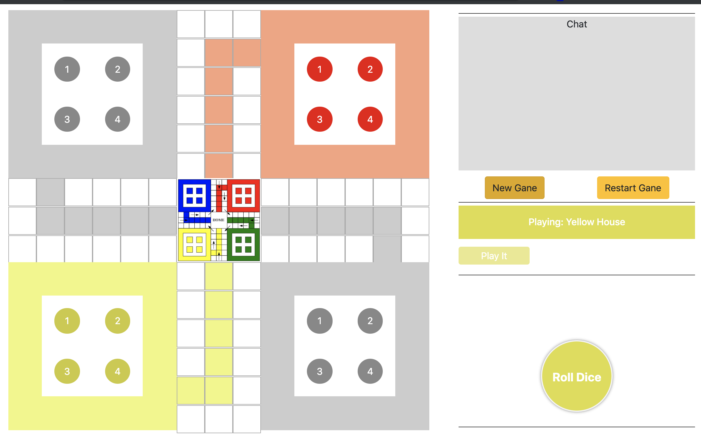
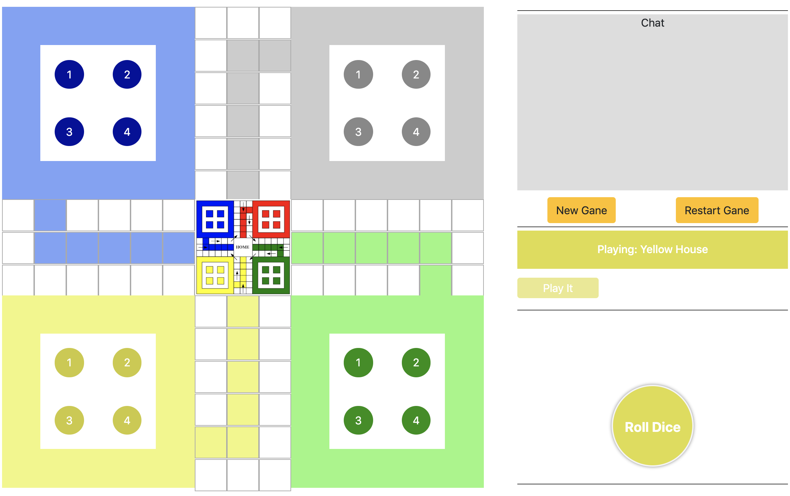
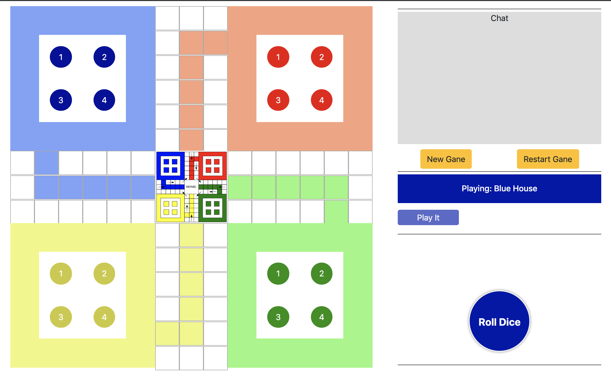

# Ludo Game #

### What is this repository for?
Desktop Ludo game built with React and Electron.

- Install nvm, node, npm, and yarn. Node 8.9.4 is the recommened minimum.

### How do preview the app? ###
- Run *_nvm use_* to set node version to 8.9.4
- Run *_yarn install_* in the application root to install dependencies
- Run *_npm run preview_* to view and play the game

### How do I get set up for development?
- Run *_nvm use_* to set node version to 8.9.4
- Run *_yarn install_* in the application root to install dependencies
- Run *_npm run work_* to start working
- Use *_npm run dev_* if you prefer to use it on the browser

### How do I build the app? (Not setup yet!)
- Run *_nvm use_* to set node version to 8.9.4
- Run *_yarn install_* in the application root to install dependencies
- Run *_npm run build_* to build the app for your platform

### Screenshot
Depending on the number of players selected, some houses may be disbaled.

##### Two Player Mode

##### Three Player Mode

##### Four Player Mode

